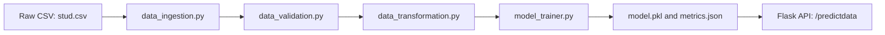

# EduScore-MLOps 
> An end-to-end MLOps pipeline that ingests raw student records and serves real-time **math-score** predictions through a lightweight Flask API.

[](https://www.python.org/)
[](https://github.com/annus3/EduScore-MLOps/blob/main/LICENSE)
[](https://github.com/annus3/EduScore-MLOps/commits/main)
[](https://github.com/annus3/EduScore-MLOps)
[](https://github.com/annus3/EduScore-MLOps/stargazers)
[](https://github.com/annus3/EduScore-MLOps/network/members)


Predicting a student’s performance is a classic regression task.
The goal of **EduScore-MLOps** is to show how that seemingly simple model can be wrapped in a *production‑ready* machine‑learning system:

* ⭐ reproducible data & model artefacts  
* ⭐ structured logging and custom error handling  
* ⭐ modular pipelines (ingestion → validation → transformation → training → evaluation)  
* ⭐ one‑click training script and REST‑style inference endpoint  
* ⭐ packaged with `setup.py` so it installs like a normal Python library  

---

## Table of Contents
1. [Quick Start](#quick-start)
2. [Project Structure](#project-structure)
3. [Scripts: File Descriptions](#scripts-file-descriptions)
4. [Deeper dive into the key code files](#deeper-dive-into-the-key-code-files)
5. [Notebook Highlights](#notebook-highlights)
6. [End-to-End Workflow](#end-to-end-workflow)
7. [Tech Stack](#tech-stack)
8. [Detailed Pipeline Walkthrough](#detailed-pipeline-walkthrough)
9. [Logging & Exception Handling](#logging--exception-handling)
10. [Running the Web App](#running-the-web-app)
11. [Roadmap](#roadmap)
12. [Contributing](#contributing)
13. [License & Acknowledgements](#license--acknowledgements)


---

## Quick Start

```bash
# 1. clone & create a fresh environment
git clone https://github.com/<your-github-handle>/EduScore-MLOps.git
cd EduScore-MLOps
python -m venv venv && source venv/bin/activate   # or conda env create -f env.yml

# 2. install project as an editable package
pip install -r requirements.txt
pip install -e .

# 3. train the model end-to-end
python src/pipeline/train_pipeline.py

# 4. serve predictions locally
python application.py           # opens http://127.0.0.1:5000/
```

Once the server is running, open your browser, fill in the form on **/predictdata**, and you’ll instantly get the predicted math score.

---

## Project Structure

```text
EduScore/
│
├── application.py            ← Flask entry point
├── setup.py / requirements.txt
│
├── artifacts/                ← Auto-generated artefacts (ignored by Git)
│   ├── model.pkl             ← Trained regressor
│   ├── preprocessor.pkl      ← Fitted ColumnTransformer
│   ├── data.csv | train.csv | test.csv
│
├── notebook/                 ← EDA & experimentation
│   ├── data/stud.csv         ← Original raw dataset
│   ├── EDA STUDENT PERFORMANCE.ipynb
│   └── MODEL TRAINING.ipynb
│
├── src/
│   ├── exception.py | logger.py | utils.py
│   ├── components/
│   │   ├── data_ingestion.py
│   │   ├── data_validation.py      ← **bonus** (see Roadmap)
│   │   ├── data_transformation.py
│   │   └── model_trainer.py
│   └── pipeline/
│       ├── train_pipeline.py
│       └── predict_pipeline.py
│
└── templates/                ← Bootstrap 5 front-end
    ├── home.html
    └── index.html
```

> **Why keep generated files under `/artifacts`?**  
> It prevents polluting source folders and makes it trivial to nuke everything with `rm -rf artifacts/` before a fresh run.

---

## Scripts: File Descriptions 

| Path | What it is | Why we need it |
|------|------------|----------------|
| **application.py** | Tiny Flask bootstrap. Maps two URLs: `/` (home) and `/predictdata` (form + POST → prediction). | Turns the model into a web service. |
| **requirements.txt** | List of third-party libraries. | Ensures everyone installs the same versions. |
| **setup.py** | `pip install -e .` helper. Reads `requirements.txt` and packages `src/`. | Lets the whole project behave like a normal Python package. |
| **README.md** | What you’re reading now. | Explains the project to newcomers. |
| **LICENSE** | MIT license text. | Open‑source legal stuff. |
| **notebook/data/stud.csv** | Raw student scores and demographics. | The starting point for everything. |
| **notebook/EDA STUDENT PERFORMANCE.ipynb** | Jupyter notebook for quick charts and first insights. | Helps you understand the data before coding pipelines. |
| **notebook/MODEL TRAINING.ipynb** | Notebook version of the training loop. | Safe sandbox to play with algorithms and hyper‑parameters. |
| **src/exception.py** | `CustomException` class. | Wraps errors with file‑name and line‑number for easier debugging. |
| **src/logger.py** | Central logging setup. | Every run gets its own `logs/*.log` file. |
| **src/utils.py** | Helper functions: `save_object`, `load_object`, `evaluate_models`. | Reusable code used across components. |
| **src/components/data_ingestion.py** | Reads the CSV, does an 80/20 split, saves to `artifacts/`. | First step of the ML pipeline. |
| **src/components/data_transformation.py** | Builds a `ColumnTransformer` (impute, one‑hot, scale) and saves it. | Makes sure training and inference see identical preprocessing. |
| **src/components/model_trainer.py** | Grid‑search over several regressors, picks the best, dumps `model.pkl`. | Core machine‑learning logic. |
| **src/pipeline/train_pipeline.py** | Glue script that calls ingestion → transformation → trainer. | One command to rebuild the entire model. |
| **src/pipeline/predict_pipeline.py** | Loads `preprocessor.pkl` + `model.pkl`, predicts from a dataframe. | Used by the Flask app and any future batch jobs. |
| **templates/home.html** | Bootstrap card with a project blurb. | Friendly landing page. |
| **templates/index.html** | The student‑data form and result display. | Front‑end for predictions. |
| **artifacts/** | Folder auto‑filled by pipeline runs. | Keeps generated data out of the source tree. |

---


## Deeper dive into the key code files

### `src/utils.py`
```text
save_object(path, obj)        -> pickle‑dumps any Python object, creates folders if missing  
load_object(path)             -> inverse of save_object  

evaluate_models(Xtr, ytr, Xts, yts, models, params)
    • Loop through each candidate model  
    • Run GridSearchCV (cv=3) on the provided param grid  
    • Re‑fit the model with the best hyper‑params  
    • Return a dict {model_name: test_R2}
```

### `data_ingestion.py` (component)
```text
class DataIngestion:
    def initiate_data_ingestion(self):
        1. Read notebook/data/stud.csv -> df
        2. os.makedirs("artifacts", exist_ok=True)
        3. df.to_csv("artifacts/data.csv")
        4. train, test = train_test_split(df, test_size=0.2, random_state=42)
        5. Save both splits to artifacts/
        6. Return file paths for downstream steps
```
Just controlled I/O plus logging – nothing fancy, but everything reproducible.

### `data_transformation.py` (component)
```text
num_cols = ["reading_score", "writing_score"]
cat_cols = ["gender", "race_ethnicity", "parental_level_of_education",
            "lunch", "test_preparation_course"]

numeric_pipeline      = SimpleImputer(strategy="mean") → StandardScaler()
categorical_pipeline  = SimpleImputer(strategy="most_frequent")
                       → OneHotEncoder(handle_unknown="ignore")
                       → StandardScaler(with_mean=False)

preprocessor = ColumnTransformer([
    ("num", numeric_pipeline, num_cols),
    ("cat", categorical_pipeline, cat_cols)
])

# fit on train → dump to artifacts/preprocessor.pkl
```

### `model_trainer.py` (component)
```text
models = {
    "RandomForest":    RandomForestRegressor(),
    "GradientBoosting":GradientBoostingRegressor(),
    "XGBRegressor":    XGBRegressor(),
    "CatBoost":        CatBoostRegressor(verbose=False),
    "Linear":          LinearRegression(),
    ...
}

params = {
    "RandomForest":    {"n_estimators":[100,150]},
    "GradientBoosting":{"learning_rate":[0.05,0.1]},
    "XGBRegressor":    {"n_estimators":[150], "learning_rate":[0.1]},
    ...
}

scores = utils.evaluate_models(...)
best_model_name = max(scores, key=scores.get)
best_model      = models[best_model_name].set_params(**best_params)
best_model.fit(X_train, y_train)
pickle‑dump → artifacts/model.pkl
```
If the winning model scores under 0.60 R², the script raises a `CustomException` so the pipeline fails loudly.

### `train_pipeline.py`
```text
data_paths  = DataIngestion().initiate_data_ingestion()
X_train,X_test,y_train,y_test = DataTransformation().initiate_data_transformation(data_paths)
model_path  = ModelTrainer().initiate_model_trainer(X_train,y_train,X_test,y_test)
```
Three calls – that’s the whole pipeline.

### `predict_pipeline.py`
```text
class PredictPipeline:
    def predict(self, features_df):
        pre  = load_object("artifacts/preprocessor.pkl")
        mdl  = load_object("artifacts/model.pkl")
        arr  = pre.transform(features_df)
        return mdl.predict(arr)
```
Stateless, so it can be reused from Flask, batch jobs, or notebooks.

---

## Notebook Highlights

### *EDA STUDENT PERFORMANCE.ipynb*
* Loads the raw CSV, checks shape & nulls.  
* Uses `sns.countplot` and histograms to compare score distributions by gender, lunch type, etc.  
* Correlation heat‑map shows reading / writing strongly correlate with math scores.

### *MODEL TRAINING.ipynb*
* Splits data, sets up identical preprocessing as the pipeline.  
* Tests several regressors side‑by‑side and visualises R² scores.  
* Includes residual plots to sanity‑check the winner.

---


## End-to-End Workflow



1. **Ingestion** – bring data in and split.  
2. **Validation** – optional schema & drift checks.  
3. **Transformation** – consistent feature engineering.  
4. **Training** – hyper‑parameter search & model selection.  
5. **Serving** – real‑time predictions via Flask.

---

## Tech Stack

| Layer                  | Libraries / Tools                        |
| ---------------------- | ---------------------------------------- |
| Language & Runtime     | Python 3.10                              |
| Data manipulation      | `pandas`, `numpy`                        |
| Modeling               | `scikit-learn`, `xgboost`, `catboost`    |
| Hyper‑parameter tuning | `GridSearchCV`                           |
| API                    | **Flask** (easy to swap for FastAPI)     |
| Experimentation        | **JupyterLab**                           |
| Packaging              | `setuptools`, `pip install -e .`         |
| Logging                | Python `logging`, custom formatter       |
| Serialization          | `pickle`                                 |
| DevOps (optional)      | Docker, GitHub Actions CI                |

---

## Detailed Pipeline Walkthrough

### `src/components/data_ingestion.py`
* Reads `notebook/data/stud.csv`.  
* Outputs  
  * `artifacts/data.csv` – clean master copy.  
  * `artifacts/train.csv`, `artifacts/test.csv` – 80 / 20 stratified split.  
* Handles path creation & exceptions via `logger.py` + `CustomException`.

### `src/components/data_transformation.py`
* Defines feature groups, builds the `ColumnTransformer`.  
* Persists transformer with `utils.save_object()`.

### `src/components/model_trainer.py`
* Candidate models & parameter grids in two dictionaries.  
* Helper `evaluate_models()` runs 3-fold CV and returns a `{model: R²}` dict.  
* Best model ≥ threshold is dumped to `model.pkl`.

### `src/pipeline/train_pipeline.py`
* Orchestrator that calls the three components in sequence.  
* One run yields all artefacts ready for inference.

### `src/pipeline/predict_pipeline.py`
* Loads artefacts, prepares user input, returns a NumPy vector.  
* Wrapped by `application.py` so the web layer stays thin.

---

## Logging & Exception Handling

| Feature | Where | Details |
|---------|-------|---------|
| **Central log file** | `logger.py` | Each run creates `logs/<timestamp>.log` with `[time] – [level] – [module:line] – message`. |
| **Rich exceptions** | `CustomException` | Adds file-name & line-number context to every raised error, making root-cause analysis faster. |

---

## Running the Web App

```bash
# after training
python application.py    # default port 5000
```

Open <http://127.0.0.1:5000/> → the *Home* card describes the project.  
Click **Predict Student Performance**, fill in the form, and hit **Predict** – the model’s estimate appears instantly.

> **Tip:** add `--host 0.0.0.0` for container deployments.

---

## Roadmap 

* [ ] Add `data_validation.py` with Great Expectations-style checks.  
* [ ] Containerise (Dockerfile, gunicorn, health probe).  
* [ ] CI pipeline: lint, unit tests, train on PR, push artefacts to GitHub Releases.  
* [ ] FastAPI / Uvicorn swap-in for async performance.  
* [ ] Streamlit playground for interactive users.  

---

## Contributing

1. Fork → create branch → commit → open PR.  
2. Run `pre-commit run --all-files` before pushing.  
3. Please keep commit messages meaningful and conventional.  


## License & Acknowledgements

This project uses the **MIT License**

See the [LICENSE](https://github.com/annus3/EduScore-MLOps/blob/main/LICENSE) file for full text.

Big thanks to the authors of *“Complete MLOps Bootcamp with 10 End‑to‑End ML Projects”* on Udemy for the foundation that inspired this work.
